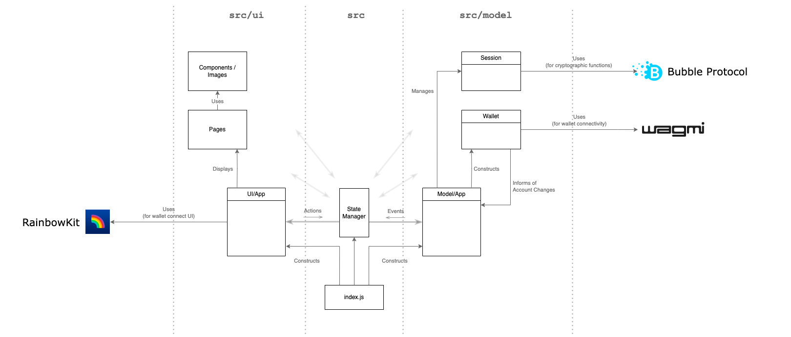

# DApp Template

React template for a basic decentralised web application. Includes login sessions, web3 wallet login and optional WalletConnect.

This template dApp can be used as a starting point for decentralised application development.

## Getting Started

1. Clone this repo then install dependencies:

```
npm install
```

2. Configure your app. See [Configuration](#configuration).

3. Start your react server:

```
npm start
```

## Dependencies

[`RainbowKit`](https://www.rainbowkit.com/) (includes [`wagmi`](https://wagmi.sh/) + [`viem`](https://viem.sh/)) - web3 wallet connectivity and UI

[`WalletConnect`](https://walletconnect.com/) - remote wallet interconnectivity

[`@bubble-protocol/crypto`](https://github.com/Bubble-Protocol/bubble-sdk/tree/main/packages/crypto) - login key generation and hash function

## Architecture

The dApp uses a Model/UI architecture with communication managed through a simple react-redux like state manager.



`src/index.js` is the entry point to the application. It constructs the model and starts the UI.

`src/state-manager.js` holds the `stateManager`, an app-wide object that manages all interactions between the model and UI. 
The model registers all data flows and functions that can be called by the UI and dispatches data updates based on external events. 
The UI subscribes to these data flows and functions.

`src/ui/App.js` is the UI's main entry point. The UI subscribes to updates from the model via the `stateManager`.

`src/model/App.js` is the model's main entry point. It contains all UI-facing functions and
maintains the current login session. It registers all Model ↔ UI data flows and functions via the `stateManager`.

The `Session` class manages a login session, storing the session data (login key and any dapp specific data) in local storage. The login key is derived from a wallet signature of the phrase "`Login to <app-name>`" (the app name is configured in `src/config.js`) and is optionally stored between sessions. If the user changes account in their wallet, the session is automatically closed and new session with the new account is created.

The `Wallet` class encapsulates all wallet activity, including login, signing, transactions and contract calls.

The `console` is overridden within `src/index.js` to add the functions `console.trace()` and `console.debug()`. These are used throughout the application. They can be toggled on or off in `src/config.js`.  Use `console.stackTrace()` to dump the stack to the console.

## Configuration

There are three files that must be configured:

`public/index.html` contains your app metadata, including title, icon and open graph metadata.

`src/config.js` contains app-specific public configuration data, such as the app name and supported blockchains.

`.env.example` (optional) copy to `.env.local` and add your WalletConnect API key to support remote wallet connectivity.

See each file for details.

## Contributing

Feel free to submit pull requests for consideration.  Join the discussion on our [Discord Server](https://discord.gg/sSnvK5C).

## Copyright

Copyright (c) 2024 [Bubble Protocol](https://bubbleprotocol.com)

Released under the [MIT License](LICENSE)